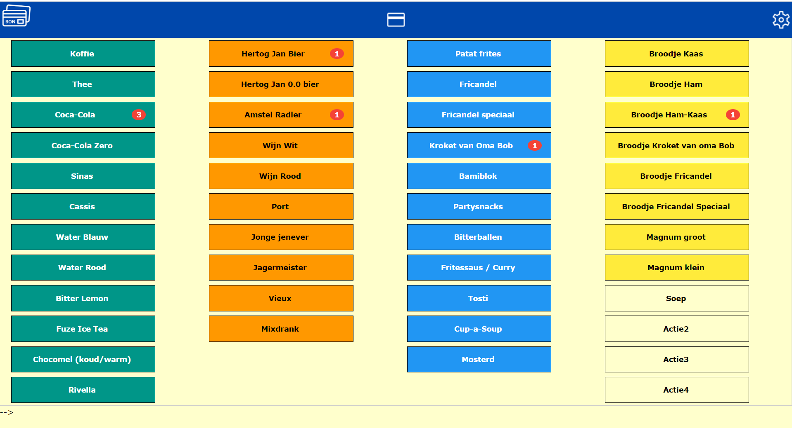
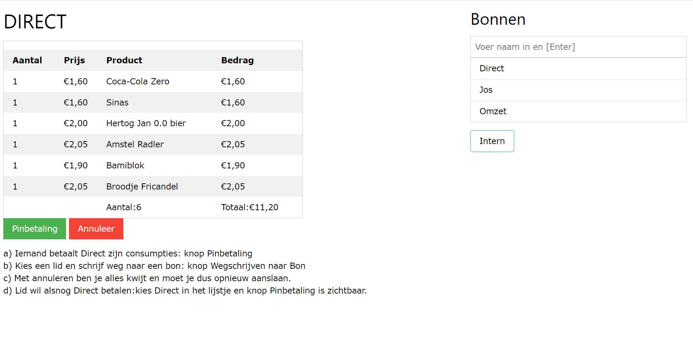
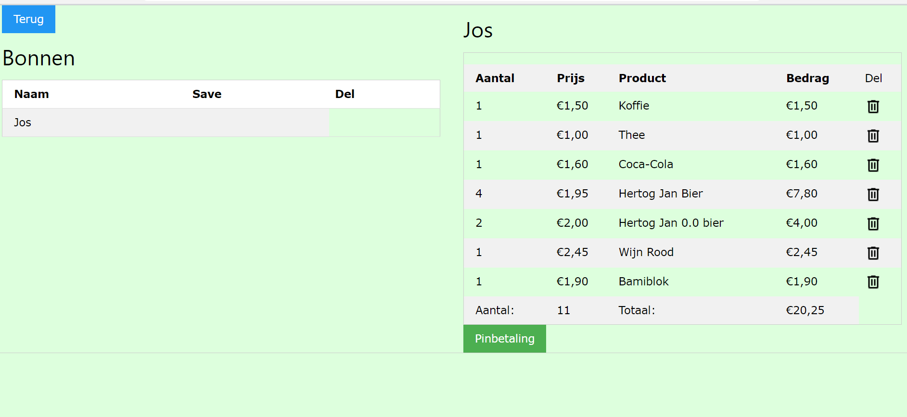
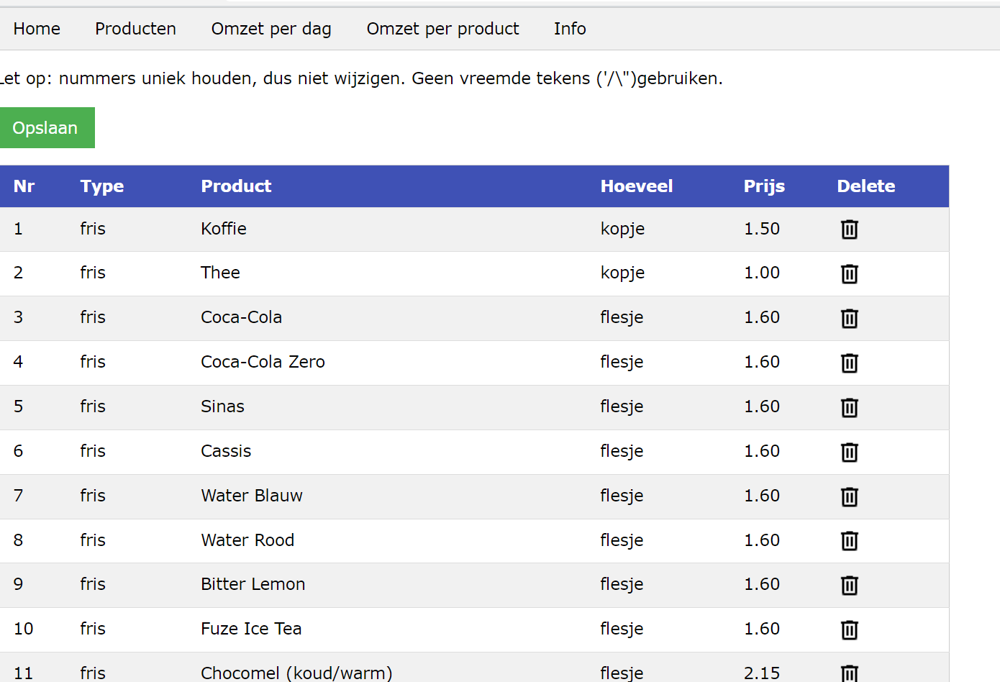

# simple_pos
Simple POS system build in PHP, jquery, database files = text

**Install**
- download Simple-Pos.zip
- extract it on your server
- it works out of the box

If one makes a purchase click on the central icon so the purches can be adressed:
- direct payment ('direct')
- or write it to a ticket on name

In 'bonnen' (receipts) all receipts on name can be processed.
The receipt also can be manipulated when it is nog right.

I the admin section products can be edited, and can the purchases be followed. (further development is following)

**Development**
Normal use should work well. 
Development is 
- the agregation of al the tickets (revenues, reports etc)
- bluetooth connection to a sumup-system (or other systems)
- ....

**Database**
Database are txt files
- ticket for a person
- file with the products
- revenues

**What can the system do?**
- load products
- make a ticket of an order
- pay directly or write it to a receipt per person
- alter a receipt

**Questions?** [Mail me!](mailto:venes@live.nl)

**Like it?**

